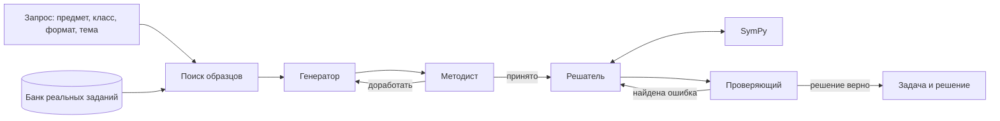

<div align="center">

# 🧮 Мультиагентная система на основе LLM для генерации и автоматической проверки математических задач

**Курсовой проект · тема № 99 · 2026/2027 учебный год**


</div>

---

## 📌 О проекте

Система из нескольких LLM-агентов, которая по запросу пользователя составляет математическую задачу **в стиле конкретного школьного формата** (МЦКО, ОГЭ, ВПР, олимпиады), решает её и проверяет решение.

Пользователь указывает предмет, класс, формат и тему, а система возвращает новую задачу с проверенным решением, изложенным методами этого класса.

Модели не обучаются: вся работа идёт через API LLM. Вычисления и проверка ответов выполняются через SymPy с помощью function calling.

### Пример

**Запрос**

```json
{
  "subject": "математика",
  "grade": 6,
  "format": "МЦКО",
  "topic": "дроби"
}
```

**Ответ системы** (иллюстрация ожидаемого результата)

> **Задача.** В школьной библиотеке 240 книг. Учебники составляют 3/8 всех книг, остальные книги художественные. Сколько художественных книг в библиотеке?
>
> **Решение.**
> 1. Художественные книги составляют 1 − 3/8 = 5/8 всех книг.
> 2. 240 · 5/8 = 150 (книг).
>
> **Ответ:** 150.
>
> **Проверка:** ответ подтверждён вычислением в SymPy, решение соответствует программе 6 класса.

---

## 🏗️ Архитектура



### Агенты

| Агент | Роль | Что возвращает |
|---|---|---|
| **Генератор** | Составляет новую задачу по образцам нужного формата | Условие, тип ответа, предполагаемая сложность |
| **Методист** | Проверяет соответствие программе класса, формату экзамена и отсутствие копирования образцов | Вердикт и замечания для доработки |
| **Решатель** | Решает задачу по шагам школьными методами, вычисления выполняет через SymPy | Пошаговое решение и ответ |
| **Проверяющий** | Независимо перепроверяет решение, ищет ошибки и указывает шаг | Вердикт, тип и место ошибки |

Агенты обмениваются сообщениями в формате JSON со строгими схемами. Циклы доработки ограничены 2–3 итерациями.

---

## 🧪 Как оцениваем систему

| Что проверяем | Метод |
|---|---|
| Точность решения | Доля верных ответов на наборе задач с известными ответами; сравнение одной модели, модели с SymPy и полной системы |
| Качество проверки | В верные решения вносятся ошибки; измеряем долю найденных ошибок и долю ложных срабатываний |
| Качество генерации | Ручная оценка задач: корректность, решаемость, соответствие классу и теме |
| Похожесть на экзамен | Слепой тест: эксперты отличают сгенерированные задачи от настоящих |
| Стоимость | Число токенов и время на одну задачу |

---

## 🛠️ Технологии

- **Python 3.11+**
- **LLM через API** (конкретные модели уточняются)
- **SymPy** для вычислений и проверки ответов
- **Pydantic** для схем сообщений между агентами
- **Streamlit** для прототипа интерфейса

---

## 👥 Команда

| Участник | Роль в проекте | GitHub |
|---|---|---|
| Борщев Аристарх Александрович | Архитектура и агенты, данные, эксперименты, интерфейс | [@username](https://github.com/username) |

**Куратор:** Голубев Александр

---

## 🗓️ План работы на год

| № | Сроки | Что делаем | Результат |
|---|---|---|---|
| 1 | октябрь 2026 | Тема, куратор, репозиторий | README (Чекпойнт 1) |
| 2 | октябрь – ноябрь 2026 | Обзор статей, сбор банка заданий | Размеченный банк образцов |
| 3 | ноябрь – декабрь 2026 | Генератор, решатель, проверяющий для одной темы | Прототип в консоли |
| 4 | январь – февраль 2027 | SymPy, поиск образцов, методист | Полная система |
| 5 | февраль – март 2027 | Эксперименты и сравнение конфигураций | Таблицы метрик |
| 6 | март – апрель 2027 | Streamlit, слепой тест | Демо |
| 7 | апрель – май 2027 | Анализ ошибок, отчёт | Защита |

---

## 📁 Структура репозитория (планируемая)

```
.
├── agents/          # агенты: генератор, методист, решатель, проверяющий
├── tools/           # обёртки SymPy для function calling
├── data/            # банк образцов заданий и наборы для оценки
├── experiments/     # скрипты и результаты экспериментов
├── app/             # интерфейс на Streamlit
├── docs/            # обзор литературы, отчёты по чекпойнтам
└── README.md
```

---

## 📄 Статус

- [x] Тема и план зафиксированы
- [ ] Обзор литературы и банк образцов
- [ ] Минимальный прототип
- [ ] Полная система с SymPy и методистом
- [ ] Эксперименты
- [ ] Интерфейс и слепой тест
- [ ] Итоговый отчёт
